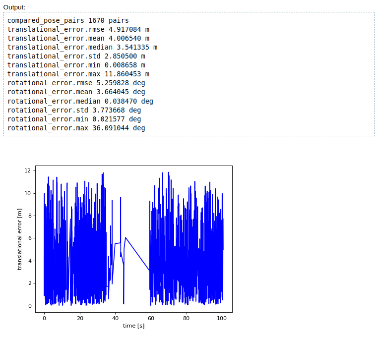
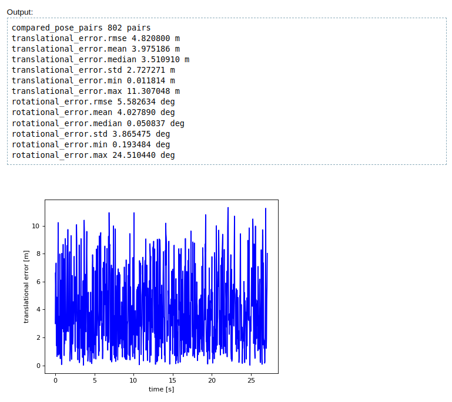

# vo_lstm

## Installation

```shell
$ pip3 install -r requirements.txt
```

## Dataset

The dataset employed in this Visual odometry demo is the [TUM dataset](https://cvg.cit.tum.de/data/datasets/rgbd-dataset/download). Specifically, the following sequences are used to train the model:

- [freiburg2_pioneer_360](https://cvg.cit.tum.de/rgbd/dataset/freiburg2/rgbd_dataset_freiburg2_pioneer_360.tgz)
- [freiburg2_pioneer_slam](https://cvg.cit.tum.de/rgbd/dataset/freiburg2/rgbd_dataset_freiburg2_pioneer_slam.tgz)
- [freiburg2_pioneer_slam2](https://cvg.cit.tum.de/rgbd/dataset/freiburg2/rgbd_dataset_freiburg2_pioneer_slam2.tgz)
- [freiburg2_pioneer_slam3](https://cvg.cit.tum.de/rgbd/dataset/freiburg2/rgbd_dataset_freiburg2_pioneer_slam3.tgz)

You have to download and extract the each sequence into the dataset/train directory.

## Train

First, configure the params to train the model. Check them in the [params.py](params.py) file. Then, run the training script.

```shell
$ python3 train.py
```

## Validation

The [TUM online validation tool](https://cvg.cit.tum.de/data/datasets/rgbd-dataset/online_evaluation) is used to validate the model. For this aim, the following sequences can be used. Download and extract this sequence into the dataset/val directory.

- [freiburg2_pioneer_360_validation](https://cvg.cit.tum.de/rgbd/dataset/freiburg2/rgbd_dataset_freiburg2_pioneer_360_validation.tgz)
- [freiburg1_room_validation](https://cvg.cit.tum.de/rgbd/dataset/freiburg1/rgbd_dataset_freiburg1_room_validation.tgz)
- [freiburg3_walking_rpy_validation](https://cvg.cit.tum.de/rgbd/dataset/freiburg3/rgbd_dataset_freiburg3_walking_rpy_validation.tgz)

Before using the validation tool, generate the position and orientations for the validation sequence. Then, upload the generated file and configure the validation tool setting the sequence length that is the frames per pose.

```shell
$ python3 val.py --path dataset/val/rgbd_dataset_freiburg2_pioneer_360_validation --model models/LSTM_hs1000_nl4_biTrue_drop0.25.pt 
```


## Results

## LSTM heavy
Se ha realizado una red LSTM con los siguientes parámetros:
- hidden_size = 1000
- num_layers = 4
- bidirectional = True
- lstm_dropout = 0.25
- learning_rate = 0.0001

Su lost en 5 epochs es [0.004364385269582272, 0.004345138557255268, 0.004348147660493851, 0.004339548293501139, 0.004340014420449734]

Siendo su resultado de los siguientes dataset:

#### Resultado rgbd_dataset_freiburg1_room_validation


#### Resultados rgbd_dataset_freiburg2_pioneer_360_validation


#### Resultado rgbd_dataset_freiburg3_walking_rpy_validation 


## LSTM tiny
La segunda red LSTM tiene los siguientes parámetros:
- hidden_size = 50
- num_layers = 2
- bidirectional = False
- lstm_dropout = 0.1
- learning_rate = 0.00001

Su lost en 5 epochs es [0.007303155027329922, 0.004988132975995541, 0.004470725078135729, 0.004584263078868389, 0.0044159479439258575]

Siendo su resultado de los siguientes dataset:


#### Resultado rgbd_dataset_freiburg1_room_validation


#### Resultados rgbd_dataset_freiburg2_pioneer_360_validation


#### Resultado rgbd_dataset_freiburg3_walking_rpy_validation 



## LSTM super_tiny

- hidden_size = 4
- num_layers = 4
- bidirectional = False
- lstm_dropout = 0.2
- learning_rate = 0.001

Su lost en 5 epochs es [0.028669161722064018, 0.004448407329618931, 0.0043800827115774155, 0.004371094983071089, 0.004364493303000927]

Siendo su resultado de los siguientes dataset:

#### Resultado rgbd_dataset_freiburg1_room_validation


#### Resultados rgbd_dataset_freiburg2_pioneer_360_validation


#### Resultado rgbd_dataset_freiburg3_walking_rpy_validation 


## LSTM PERDIDA
No apunte los paramentos 
 


